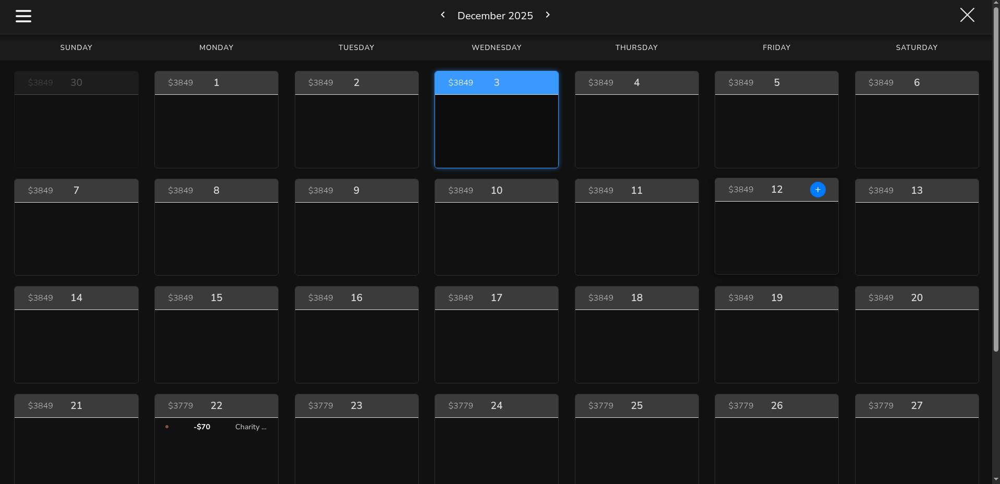
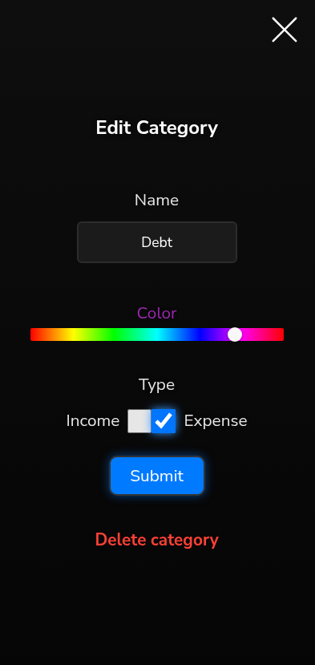
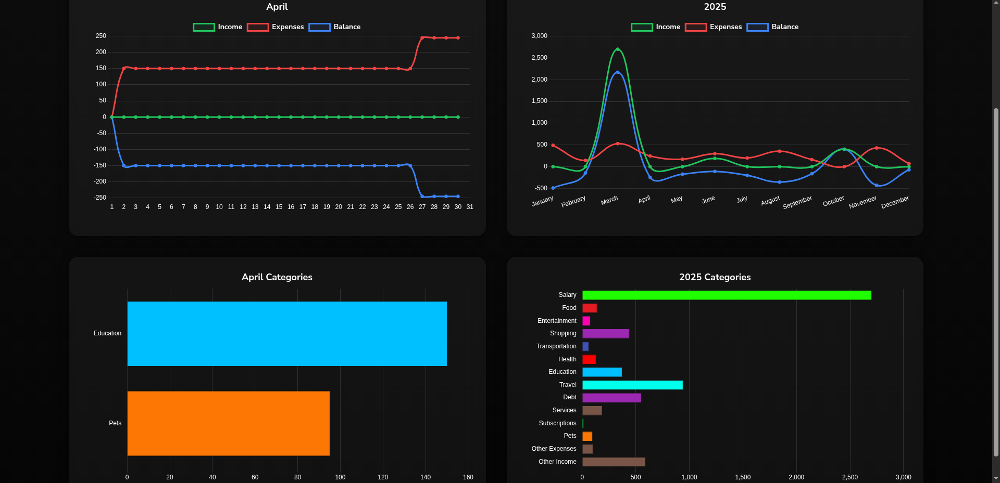
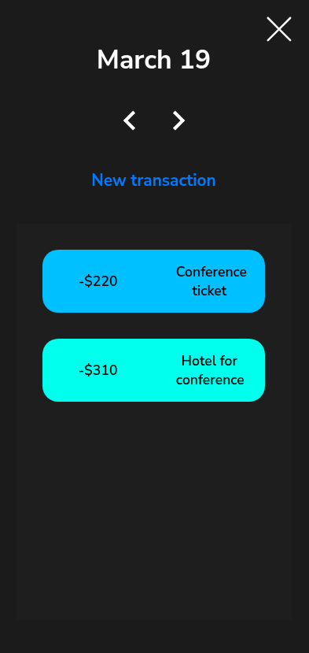
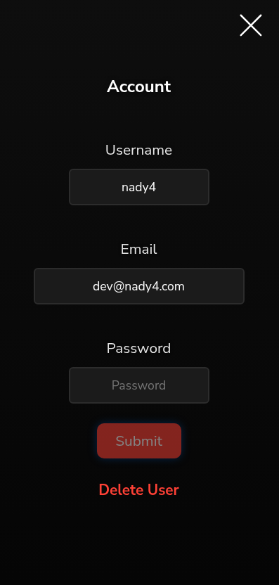

<h1 align="center"> Calendar Money </h1>

<p align="center">
💸 Full-stack cash-flow management web application built using TypeScript, Vite, Node.js, Express and MongoDB. Handles authorization and authentication via JWT and provides detailed financial analytics with charts.
</p>

<p align="center">
    
    
    
    
    
    
</p>

<br>

## 💾 Installation & Setup

### Backend

```sh
# 📥 Clone the repository
git clone https://github.com/nady4/calendar-money-api

# 📂 Move to the project folder
cd calendar-money-api

# 📦 Install dependencies
npm install

# 🛠️ Create .env file
cat <<EOF > .env
PORT=3000
MONGODB_URL=mongodb://localhost:27017/calendar-money
JWT_SECRET=yoursecret
EOF

# 🚀 Run the app
npm run dev
```

### Frontend

```sh
# 📥 Clone the repository
git clone https://github.com/nady4/calendar-money

# 📂 Move to the project folder
cd calendar-money

# 📦 Install dependencies
npm install

# 🚀 Run the app (you will need a backend first)
npm run dev
```

<br>

## 🚀 Tech Stack

| Technology  | Version |
| ----------- | ------- |
| Node.js     | ^18+    |
| Express     | ^4.21.1 |
| TypeScript  | ^5.6.3  |
| Mongoose    | ^8.8.0  |
| ts-node-dev | ^2.0.0  |

<br>

## Endpoints 🛠️

- `POST /register`  
  Registers a new user. Accepts a `username` and `password` in the request body. Returns a JSON web token if successful.

- `POST /login`  
  Logs in a user. Accepts a `username` and `password` in the request body. Returns a JSON web token if successful.

- `POST /logout`  
  Logs out the currently authenticated user.

- `POST /categories/:userId`  
  Creates a new category for the specified user. Requires a valid JSON web token.

- `PUT /categories/:userId`  
  Updates a category for the specified user. Requires a valid JSON web token.

- `DELETE /categories/:userId`  
  Deletes a category for the specified user. Requires a valid JSON web token.

- `POST /transactions/:userId`  
  Creates a new transaction for the specified user. Requires a valid JSON web token.

- `PUT /transactions/:userId`  
  Updates a transaction for the specified user. Requires a valid JSON web token.

- `DELETE /transactions/:userId`  
  Deletes a transaction for the specified user. Requires a valid JSON web token.

- `GET /users/:userId`  
  Retrieves user information. Requires a valid JSON web token.

- `PUT /users/:userId`  
  Updates user information. Requires a valid JSON web token.

- `DELETE /users/:userId`  
  Deletes the user account. Requires a valid JSON web token.

<br>

## Environment Variables 🔐️

The following environment variables are used in this code:

- `MONGODB_URL` : the URL of the MongoDB database
- `JWT_KEY` : the secret key to sign JSON web tokens with
- `PORT` : the port number to run the web server on

<br>

## 📬 Contact

### 💌 Email: **dev@nady4.com**
### 💼 LinkedIn: [nady4](https://www.linkedin.com/in/nady4)
### 👩🏻‍💻 GitHub: [@nady4](https://github.com/nady4)
