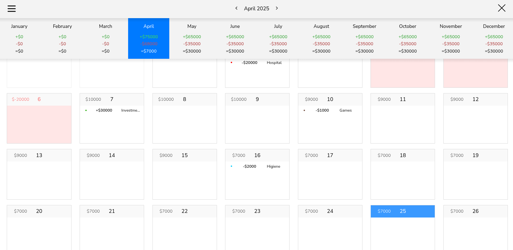
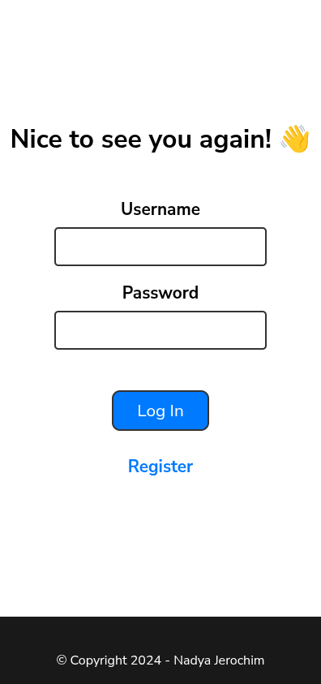
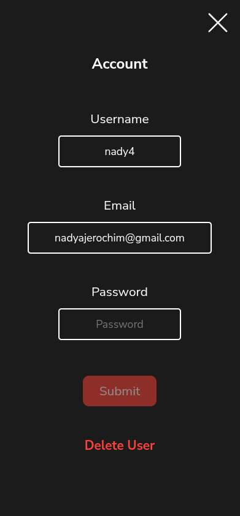

<p align="center">
    
</p>
<h1 align="center"> Calendar Money </h1>

<p align="center">
💸 Cash-flow management web app built with TypeScript, React, Node.js, Express, and MongoDB.
</p>

<p align="center">
    
    
    
    
    
</p>

<br>

## 💾 Installation & Setup

### Backend

```sh
# 📥 Clone the repository
git clone https://github.com/nady4/calendar-money-api

# 📂 Move to the project folder
cd calendar-money-api

# 📦 Install dependencies
npm install

# 🛠️ Create .env file
cat <<EOF > .env
PORT=3000
MONGODB_URL=mongodb://localhost:27017/calendar-money
JWT_SECRET=yoursecret
EOF

# 🚀 Run the app
npm run dev
```

### Frontend

```sh
# 📥 Clone the repository
git clone https://github.com/nady4/calendar-money

# 📂 Move to the project folder
cd calendar-money

# 📦 Install dependencies
npm install

# 🚀 Run the app (you will need a backend first)
npm run dev
```

<br>

## 🚀 Tech Stack

| Technology  | Version |
| ----------- | ------- |
| Node.js     | ^18+    |
| Express     | ^4.21.1 |
| TypeScript  | ^5.6.3  |
| Mongoose    | ^8.8.0  |
| ts-node-dev | ^2.0.0  |

<br>

## 📬 Contact

- 💌 Email: **nadyajerochim@gmail.com**
- 💼 LinkedIn: [/nady4](https://www.linkedin.com/in/nady4)
- 👩🏻‍💻 GitHub: [@nady4](https://github.com/nady4)
